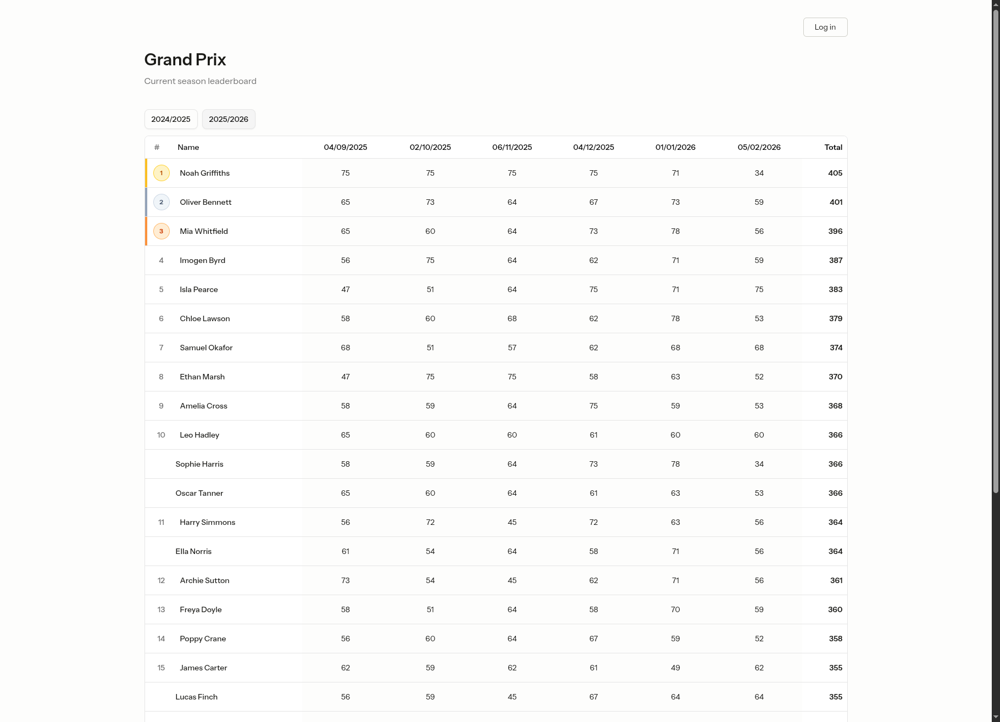

<div align="center">



### Grand Prix

A volleyball tournament and season tracker built to replace whiteboard scoring with a fast, intuitive digital interface.

[Live Demo](https://grand-prix.laravel.cloud) · [Portfolio Write-up](https://www.joshgretton.co.uk/grandprix)

</div>

<br>

#### About

My volleyball club runs a development session for beginner players once a week. The first Thursday of every month is Grand Prix night. This is a round robin tournament where teams are picked by the coach, games are timed, and everyone plays each other at least once. It's relaxed, it's fun, and the scoring is a nightmare.

Each player receives their team's final score as their personal points for that session. There's also a rule to stop players falling too far behind when they miss a session: if a player is absent, they're automatically awarded ten points less than their lowest attended score that season. At the end of the season the top three players win a prize.

At the moment, the coach writes scores on a whiteboard, takes a photo, then manually uploads each player's score to a leaderboard website. I knew I could make that process much more pleasant.

<br>

#### Features

- Drag-and-drop team builder: drag players from the available pool into teams before starting
- Dynamic round scoring: rounds are added on demand during a tournament, with scores saved to localStorage as you type
- Batch score submission to handle unreliable connectivity
- Automated leaderboard with absence penalty system
- Season management with active season switching
- Player roster with attendance tracking and active/inactive status
- Read-only demo account for portfolio visitors

<br>

#### Built With

- Laravel 12
- React + TypeScript
- Inertia.js
- Tailwind CSS + shadcn/ui
- Pest

<br>

#### Want to try it yourself?

You can explore the app using the demo account on the [live demo](https://grand-prix.laravel.cloud), or clone the repo and run it locally.

<br>

**Demo account**

- **Email:** account@grandprixdemo.com
- **Password:** shhh-its-a-secret

Browsing is unrestricted. Any attempt to create, update, or delete data will be blocked (I have trust issues with you lot).

<br>

**Run locally**

1. Clone the repo and install dependencies

```bash
git clone https://github.com/jgretton/grand-prix.git
cd grand-prix
composer install
npm install
```


1. Configure your environment

```bash
cp .env.example .env
php artisan key:generate
```


1. Run migrations, seed a user, and start the server

```bash
php artisan migrate
php artisan db:seed
composer run dev
```


Registration is disabled. The seeder creates a default account (`test@example.com` / `password`) and seeds 30 players so you have data to work with straight away.

<br>

---

<div align="center">
<sub>Built by <a href="https://www.joshgretton.co.uk">Josh Gretton</a></sub>
</div>